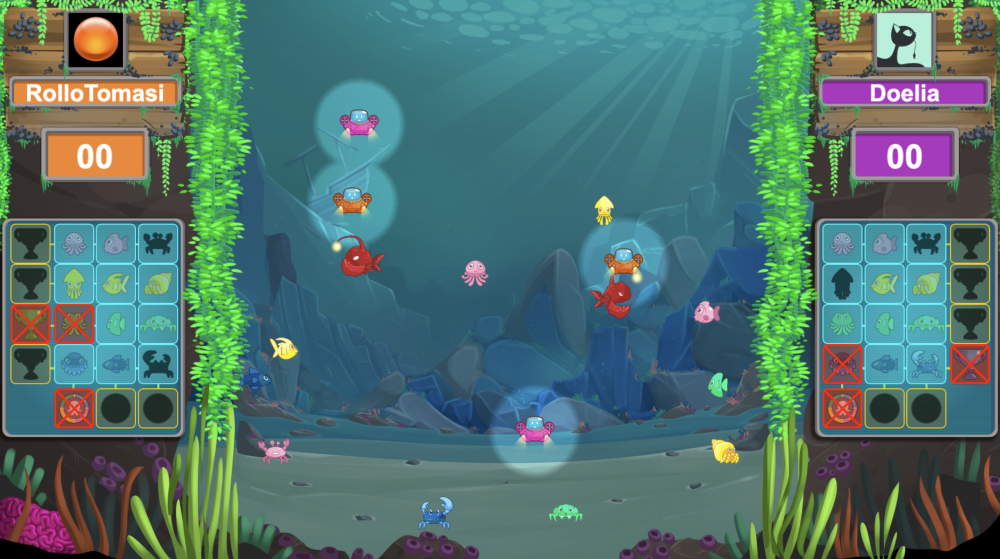

# CODINGAME FALL CHALLENGE 2023

Bot competition organized by Codin Game. We have to code the behavior of drones that must scan fish in an aquarium faster than their opponents.

Fight example : https://www.codingame.com/replay/763335946

## Results

My bot finished at 84th position out of 20,593 participants. I participated in team with my mates from Poisson Soluble.

https://www.codingame.com/contests/fall-challenge-2023/top-companies

