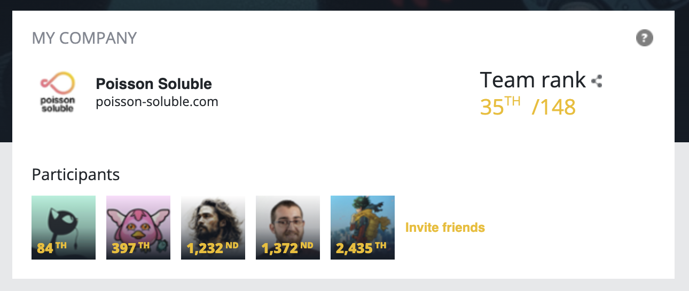

# CODINGAME FALL CHALLENGE 2023

Bot competition organized by Codin Game. We program the behavior of drones that must scan fish in an aquarium faster than their opponents.

Fight example : https://www.codingame.com/replay/763335946

## Results

My bot finished in 84th position out of 20,593 participants.

I participated in a team with other members of my company.

https://www.codingame.com/contests/fall-challenge-2023/top-companies

